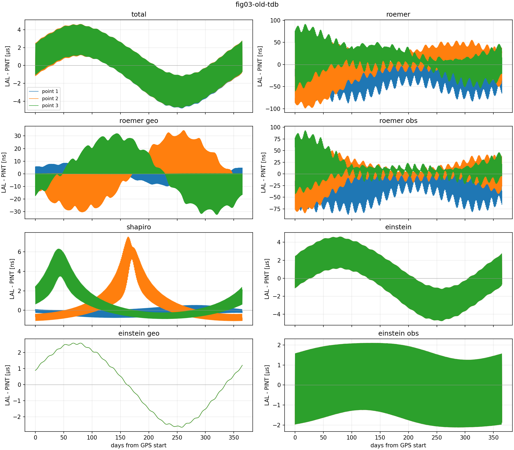
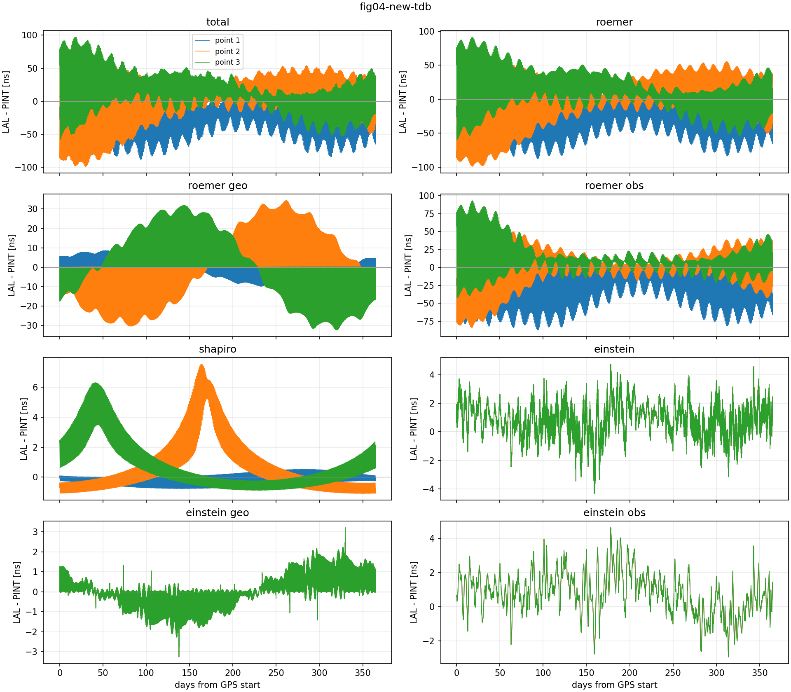
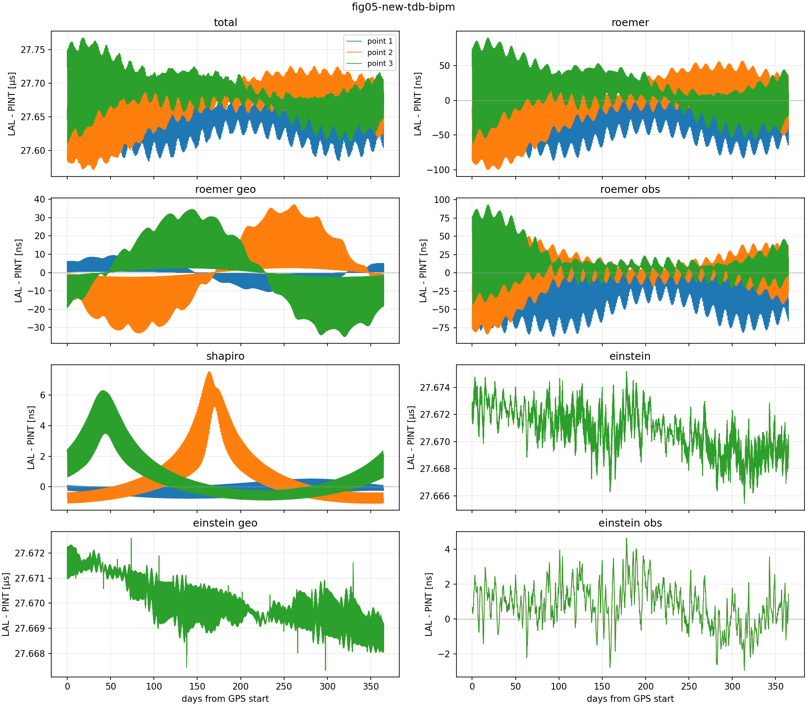
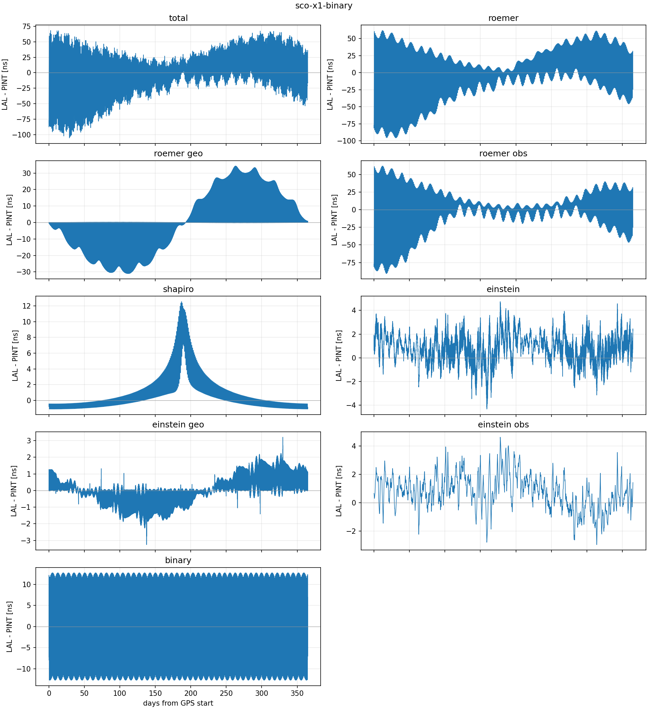

# check-lalsuite-timing-model

This package compares the LALSuite time-delay model against PINT. It includes
a patch to LALSuite that exposes the individual delay components and reproduces
the comparisons in [the accompanying paper](https://arxiv.org/abs/2608.26271).

Public LVK LALSuite repositories:

- GitHub: <https://github.com/lscsoft/lalsuite>
- LVK GitLab: <https://git.ligo.org/lscsoft/lalsuite>

## Paper data runs

The scripts in `reproduce/` generate the comparison data for Figs. 3, 4, and
5, plus one example using Sco X-1 binary parameters:

```bash
./reproduce/fig03-old-tdb.sh
./reproduce/fig04-new-tdb.sh
./reproduce/fig05-new-tdb-bipm.sh
./reproduce/sco-x1-binary.sh
```

They write into separate subdirectories under `results/`.

## Reproduced results

The repository includes the generated numerical data, summaries, run logs, and
quick-look figures. Each plot shows every available LALSuite-minus-PINT timing
component; the three paper runs contain one curve for each sky position.

### Figure 3: legacy LALSuite TDB model

[](results/fig03-old-tdb/timing-differences.png)

### Figure 4: updated LALSuite TDB model

[](results/fig04-new-tdb/timing-differences.png)

### Figure 5: updated TDB model with PINT BIPM corrections

[](results/fig05-new-tdb-bipm/timing-differences.png)

### Sco X-1 binary example

[](results/sco-x1-binary/timing-differences.png)

The underlying `timing-components.npz`, `summary.json`, `timings.json`, and
`metadata.json` files are in the corresponding result directories.

## Quick plots

Plot every `difference_*` field found in a result:

```bash
python3 scripts/plotTimingDifferences.py results/fig03-old-tdb
python3 scripts/plotTimingDifferences.py results/fig04-new-tdb
python3 scripts/plotTimingDifferences.py results/fig05-new-tdb-bipm
python3 scripts/plotTimingDifferences.py results/sco-x1-binary
```

Each command writes `timing-differences.png` into the corresponding result
directory. Pass either a result directory or its `timing-components.npz` file.
Use `--output figure.pdf` to select another path or format.
